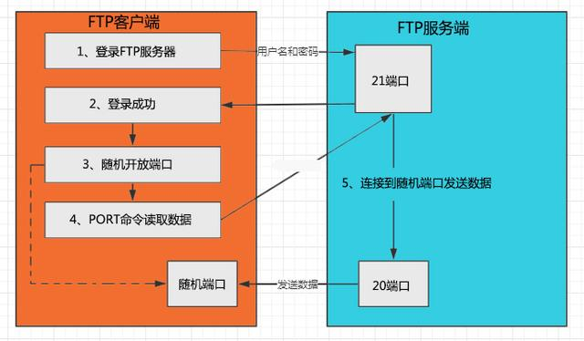

# FTP
Ref. https://www.cnblogs.com/greencollar/p/13672353.html

FTP是TCP/IP协议组中的协议之一，TP协议由两个部分组成：

    FTP服务器(用来存储文件)
    FTP客户端(用户可以使用FTP客户端通过FTP协议访问位于FTP服务器上的资源)
    
默认情况下FTP协议使用TCP端口中的20和21这两个端口。21端口用于传输控制信息，而是否使用20作为传输数据的端口与FTP使用的传输模式有关，如果采用被动模式则具体使用哪个端口要服务器端和客户端协商决定。FTP传输模式分为以下两种：

    主动模式(Port)
    被动模式(Passive)

#### 主动模式(Port)
FTP客户端首先和FTP服务器的TCP21端口建立连接，通过这个通道发送命令，客户端需要接收数据的时候在这个通道上发送PORT命令。 PORT命令包含了客户端用什么端口接收数据。在传送数据的时候，服务器端通过自己的TCP 20端口连接至客户端的指定端口发送数据。

#### 被动模式(Pasv)
在建立控制通道与主动模式相似，但建立连接后是Pasv命令。FTP服务器收到Pasv命令后便随机打开一个高端端口(端口号大于1024)并且通知客户端在这个端口上传送数据的请求，客户端连接FTP服务器此端口，通过三次握手建立通道，然后FTP服务器将通过这个端口进行数据的传送。

注意：很多防火墙在设置的时候都是不允许接受外部发起的连接的，所以许多位于防火墙后或内网的FTP服务器不支持PASV模式，因为客户端无法穿过防火墙打开FTP服务器的高端端口;而许多内网的客户端不能用PORT模式登陆FTP服务器，因为从服务器的TCP 20无法和内部网络的客户端建立一个新的连接，造成无法工作。

# SFTP
Ref. https://www.cnblogs.com/greencollar/p/13672353.html

SFTP是SSH File Transfer Protocol的缩写，安全文件传送协议。SFTP与FTP有着几乎一样的语法和功能。SFTP为SSH的其中一部分，是一种传输档案至 Blogger 伺服器的安全方式。其实在SSH软件包中，已经包含了一个叫作SFTP的安全文件信息传输子系统，SFTP本身没有单独的守护进程，它必须使用sshd守护进程(端口号默认是22)来完成相应的连接和答复操作，所以从某种意义上来说，SFTP并不像一个服务器程序，而更像是一个客户端程序。

SFTP 基于默认的22端口（ssh端口），是ssh内含的协议，只要启动了sshd就可以使用。sftp采用ssh加密隧道，安全性比ftp强

#### 配置
/etc/ssh/sshd_config

# 区别
Ref. https://www.cnblogs.com/greencollar/p/13672353.html

FTP与SFTP两者有什么区别

    链接方式：FTP使用TCP端口21上的控制连接建立连接。而，SFTP是在客户端和服务器之间通过SSH协议(TCP端口22)建立的安全连接来传输文件。
    安全性：SFTP使用加密传输认证信息和传输的数据，所以使用SFTP相对于FTP是非常安全。
    效率：SFTP这种传输方式使用了加密解密技术，所以传输效率比普通的FTP要低得多。
    配置：SFTP简单太多了，只用一个22端口解决一切

# FTP Server安装与配置 (vsftpd) 
[Alpine 环境下的安装过程 —— 参见 安装-vsftpd 章节](/markdown/Postmarket_OS.md#安装-vsftpd)