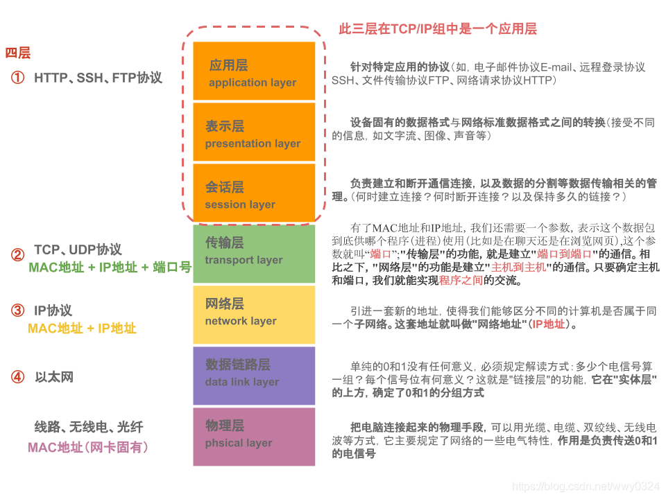
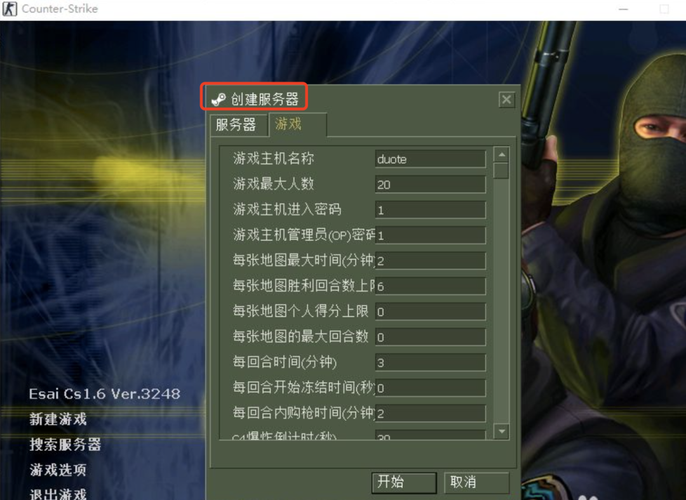

# TCP/IP 与 OSI

## 几幅图搞定 TCP/IP
ref. https://www.w3cschool.cn/architectroad/architectroad-tcp-ip.html

ref. https://blog.csdn.net/wwy0324/article/details/109310658

OSI七层  


tcpip五层  



tcpip四层  


## 路由器与交换机
ref. https://cloud.tencent.com/developer/article/1813700

作者专栏 https://cloud.tencent.com/developer/column/91177  
https://github.com/xiaobaiTech/golangFamily

故事就从一个车轱辘说起吧。先来看一个车轱辘。

<!--  -->


辐条从车轱辘边缘，一直汇聚到 中心的轴，这个轴在英文里叫**hub**。

而我们今天要讲到的**集线器**，英文里也叫**hub**。

都叫**hub**，多少有点关系，看下这面这个图大概能明白，其实两者有点像。


hub的由来

大概想表达的意思是，它是汇聚网线的中心，因此就叫**集线器**。

所以可以理解，大家常逛的 **Github，Docker Hub, 还有P\*\*hub** ，都是为了表达它们是**某类资源的中心**了吧。

那么**集线器是什么**呢？那就要从**电脑是怎么互联的**这个话题说起。

小学的时候，有一种网吧，它其实是不能上外网的。也就是不能打开度娘，不能搜索资料。

不能上网的网吧还能叫网吧？

**能**。虽然不能上外网，但网吧老板可以把很多台机子连起来，实现网吧内互联，形成一个**局域网**（**L**ocal **A**rea **N**etwork，简称**LAN**）。

网吧内互联之后，就可以放上各种游戏，比如CS，实现网吧内对线。

这种网吧有种好处，**没有那么多键盘侠**。

毕竟你不知道什么时候键着键着，对方就*顺着网线***找过来了**。

对战直接**从线上转移到线下**了。

因此大家打游戏都很和谐，客气，场面十分感人就是了。

那么网吧内的电脑是怎么互联呢？

### 一根网线互联电脑

从最简单的场景说起，假设网吧内只有**两台**电脑


两台电脑互联

随便连根网线就能实现互联吗？

**当然不是。**

还记得网络分层吗?


网络分层

数据如果要进行传输，会从A电脑经过这些网络分层把消息组装好，再到B电脑层层解包。

网线，只是代替了上面的**灰色部分**，实现**物理层**上互联。

如果想要两台电脑互联成功，还需要确保每一层所需要的步骤都要做到位，这样数据才能确保正确投送并返回。

我们自顶向下，从细节开始说一下实现互联需要做什么。

##### 应用层

该层的网络功能由应用本身保证。

假设两台电脑是打算用游戏进行联网，那么该应用层的功能由游戏程序保证。

##### 传输层

绝大部分游戏用的传输层协议都是TCP，我们可以看下**TCP报头**。


TCP报头

这里面我们需要关注的是**源和目的端口**，这个可以定位到这台电脑上哪个进程在收发数据。

这两个端口信息一般是游戏内部已经填好。

AB两台电脑，其中一台作为服务端启动，比如A，起了个[**服务器**](https://cloud.tencent.com/act/pro/promotion-cvm?from_column=20065&from=20065)进程。



建立服务器

服务器会开放一个**固定的端口**，比如27015。这就是**目的端口**。

这时候A和B都可以搜索到这个服务器。启动一个**客户端**进程，连接进入A的**服务器**进程。

而源端口，则由A和B自己生成。


##### 网络层

上图除了端口，我们还看到一个`192.168.0.105`，这个就是A的**IP地址**。

我们看一下IP层的报文头。


IP报头

这里面需要关注是**源和目的IP地址**。

如果两台电脑想通过一根网线进行消息通信，那么他们需要在一个**局域网**内。

这意味着，他们的子网掩码需要一致。局域网内，假设子网掩码是 `225.225.225.0`，会认为 `192.168.0.x` 这些IP都属于一个局域网。所以当A的IP地址是`192.168.0.105` 时，那么B的IP地址可以配成`192.168.0.106` 。

关于IP这一块是啥，后面会细讲，大家如果没明白我说的是啥，不要急。

组装好网络层报头后，数据包传入到数据链路据层。

##### 数据链路层

以上解决了网络层的互联，而在数据链路层，数据包里需要拼接上**MAC报头**。先看下MAC报头长什么样子。


MAC报头

其中需要关心的是标红的**源和目的MAC地址**。MAC地址可以粗略理解是这台电脑网卡的唯一标识。大概长这样

```javascript
28:f9:d3:62:7d:31
```

复制

源和目的地址，在发送消息的时候就会被填上。

但是A只知道自己的MAC地址，怎么才能知道B的MAC地址呢？

这时候需要ARP协议。

**ARP**（**A**ddress **R**esolution **P**rotocal），即地址解析协议。用于将IP地址解析为以太网的MAC地址的协议。

在局域网中，当主机A有数据要发送给主机B时，A必须知道B的IP地址。

但是仅仅有IP地址还是不够的，因为IP数据报文还需要在**数据链路层**封装成**帧**才能通过物理网络发送。因为发送端还必须有接收端的MAC地址，所以需要一个从IP地址到MAC地址的映射。ARP就是干这事情的协议。


ARP流程

+   A查本地ARP表发现B的IP和MAC映射关系不存在
+   A通过ARP广播的形式向局域网发出消息，询问某IP对应的MAC地址是多少。比如A此时知道B的IP，但并不知道B的MAC地址是多少，就会尝试在局域网内发起ARP广播，询问局域网下所有机器，哪个机器的IP与B的IP一致。
+   B收到这个ARP消息，发现A要问的IP与自己的IP一致，就会把自己的MAC地址作为应答返回给A。
+   此时A就知道了B的MAC地址，顺便把消息记录到本地ARP表里，下次直接用表里的关系就行，不需要每次都去问。

##### 物理层

从数据链路层到物理层，数据会被转为**01比特流**。

此时需要把比特流传到另一台电脑。

通过一根网线，两段水晶头插入网口，把两台电脑连起来。

但对网线有一些要求。

这根网线两端的水晶头需要采用**交叉互联法**。


交叉互联法

水晶头里有8根线，**注意上图里的颜色**，是有顺序的。第1、2根线起着收信号的作用，而第3、6脚发信号的作用。将一端的1号和3号线、2号和6号线互换一下位置，就能够在物理层实现一端发送的信号，另一端能收到。

当然，现在有些网卡有**自适应**的功能，就算是**直连互联法**的线，也能有**交叉互联法**的效果。如果你用的是这种网卡，就**当我物理层这块什么都没说吧**。

##### 互联

此时，在确保**关闭****防火墙**的前提下，可以尝试从A电脑中ping一下B，再从B电脑中ping一下A。如无意外，都能ping通。

A给B发个消息，从应用层到数据链路层，会分别加上A和B的各种''身份信息"。比如在传输层会加上A和B的应用端口号，在网络层加上源和目的IP，在数据链路层会加上源和目的网卡的MAC头部信息。

B收到消息后逐层解包，验证，最后顺利到达应用层。实现AB两台机器消息互通。

至此游戏就能正常联机对线，两台电脑互联成功！

### 什么是集线器

两个人打cs，总会觉得无聊，但是每台电脑又只有一个网线口。

想要邀请更多的人一起玩，怎么办？


三台电脑互联

那就要回到文章开头提到的**集线器（hub）**了。

这是个工作在**物理层**的设备。

有**多个网口**，很好的解决了电脑上只有一个网口的问题，可以做到多台电脑的网线都插入到集线器上。

同时工作原理也非常简单，会把某个端口收到的数据，输入到**中继电路**。

中继电路的基本功能是将输入的信号广播到集线器的所有端口上。

简单来说就是无脑复制N份到其余N个端口上。


集线器互联

数据复制到N个端口后。对应转发到N台机器里。

##### 集线器内部结构

说到这里，已经对集线器有个大概认识了。

接下来，我们看下集线器的内部结构。


集线器内部结构

从A网口进入集线器的消息，此时还是电信号。这里经过一个PHY模块。

> 要理解PHY模块的作用，首先要先了解每个网口，都可能接着网线（*废话*），而每根网线的传输的格式都是有可能不同的。而PHY的作用，就是把这些格式转化为一个通用的格式。 举个例子。PHY就好比一个翻译器，有的人说英文，有的人说日文。但是PHY，会把它统一转为普通话，给内部电路处理。内部电路处理完之后，再经过PHY模块，转为英语，或日文从对应网口里输出。

经过PHY的处理后，以电信号的形式输入到中继电路，被无脑广播，再次经过PHY模块后变成BCD网口的格式输出。

这里面的电信号，是会受噪声干扰，导致信号形变出错的。

但就算是错了，也还是会**原封不动**的广播出去，这就是上面提到**无脑**的精髓所在。

那信号如果出错了怎么办？

只能让接收方收到消息后进行校验。

还记得上文里提到的数据链路层的MAC报头里最末尾有个**FCS**吗？

FCS里存放的是发送方通过循环冗余校验CRC计算得到的值。

**接收方**用收到的数据算一次CRC，与FCS里的值进行对比。

如果一致，那证明数据没问题。如果出错，则**直接丢弃**。

> 当然，丢弃包并不会影响数据的传输， 因为丢弃的包不会触发确认响应。因此协议栈的 TCP 模块会检测到丢包， 并对该包进行重传。

如果消息没出错，但是因为无脑广播，C也能收到A发给B的数据包。

此时 C 会在接受到数据包后一层层的"剥开"。

正常情况下，在数据链路层时，识别到目的 MAC 地址跟 C 的不一致时，也会把**数据丢弃**。


集线器互联时广播消息

### 什么是交换机

目前只有 ABC 三台机器，每次都是广播发消息倒还好。

如果机器越来越多，每台机器发一条消息，都会被广播，就有点顶不住了。

举个例子。

假设N台机器，其中两台机器A和B，A发到B和B发给A，共两条消息。

如果这N台机器，用的是集线器。还是AB之间互发消息，每条消息都是广播的话，就是(N-1)+(N-1)条消息，差距有些大，对网络资源浪费就有些严重了。

那么，有没有可能做到，A发给B的消息，就不要转发给C呢？

可以的，把集线器换成交换机。

**交换机**，又叫**switch**，跟集线器长得很像。

但是功能更强一些，从网络分层上来说，属于**数据链路层**，比集线器所在的**物理层**还要高一层。

所有发到交换机的数据，都会先进入交换机的缓存区。接着消息再被**转发**到对应机器上。

注意这里用的是**转发**，而不是**集线器的广播**，交换机是怎么做到转发的呢？

##### MAC地址表

交换机内部维护了一张**MAC地址表**。

记录了 端口号和MAC地址的对应关系。

这个表的数据是交换机**不断学习**的结果。

当A发消息到交换机时，交换机发现消息是从1号端口进来的，则会在MAC地址表上，记录A的MAC地址对应1号端口。

如果A没有很长时间没发消息到这个1号端口，那这条记录就会**过期并被删除**。

那么，当时间足够长，ABC 都发过消息给交换机后，地址表就会有完整的关系信息。


交换机互联时转发消息1

+   A准备发送消息给B，此时A会把B的MAC地址，放入要发送的数据里。数据顺着网线发出。
+   交换机从端口收到数据，会把数据里的源和目的MAC地址提出来，跟MAC地址表进行对比。
+   发现**B的MAC地址正好在2号端口**，那么就把数据转发给2号端口。
+   此时B电脑从网线收到来自交换机2号端口的数据。

##### 两种特殊情况

正常流程很清楚了，看两个**特殊情况**：

1.  交换机查询地址表时，发现目的 MAC 地址的目标端口和这个包的源端口，是同一个端口，怎么办？

先说结论，**会直接丢弃这个包**。

我们看下，假设它不丢弃，会发生什么情况。


交换机源和目的端口一致时

+   A发了个消息给B，中间经过一个**集线器**，此时消息会被**广播**到B和交换机。
+   此时B收到**第一条**A发给它的消息
+   交换机从1号端口收到A的消息后，解包，获得目的MAC地址是BB-BB-BB-BB-BB-BB。查MAC地址表，发现要发到1号端口。此时，源和目的端口都是同一个，**如果交换机不丢弃这个消息**，B会收到**第二条**A发给它的消息。

A只发了**一次**消息，B却收到**两条**消息，明显不对。

因此，当交换机查询地址表时，发现目标端口和源端口，是同一个端口时，会丢弃这个包。

1.  MAC地址表里找不到对应的MAC地址，怎么办？

这可能是因为具有该地址的设备，还没有向交换机发送过包，或者这个设备一段时间没有工作，导致地址被从地址表中删除了。

这种情况下，交换机无法判断应该把包转发到哪个端口，只能将包转发到除了源端口之外的所有端口上，无论该设备连接在哪个端口上，都能收到这个包。

此时，交换机就会跟集线器一样进行**广播**。

发送了包之后目标设备会作出响应，只要返回了响应包，交换机就可以将它的地址写入地址表，下次也就不需要把包 发到所有端口了。

##### 交换机内部结构

再看下交换机内部结构。


交换机内部结构

其实对比可以发现，交换机和集线器内部结构很像。

重点需要提到的是MAC模块。消息以**电信号**的形式从网口进入，到了PHY会被转成**通用格式**的电信号。而MAC模块的作用是把这个电信号转为**数字信号**，这样就能提取出MAC包头，并通过MAC数据帧末尾的**FCS校验**这个包有没有问题，如果没问题，则把数据放到**内存缓冲区**里，否则直接丢弃。

另外，这个MAC模块，虽然这么叫。但其实**交换机MAC模块不具有 MAC 地址**。因此交换机的端口不核对接收方 MAC 地址，而是直接接收所有的包并存放到缓冲区中。

放入到内存缓冲区后，还会把MAC地址和端口号记录到MAC地址表中。同时检查**目的MAC地址**在不在MAC地址表中，在的话则会**转发**到对应端口。否则**广播**。

##### 交换机与网桥的区别

网桥，本质上可以理解为**两个网线口的交换机**，正好可以把两台电脑给连起来，也叫**桥接**。而交换机，则是**多网线口的网桥**，可以把多台电脑给连（桥接）起来。

其他功能方面，大差不差，不必太过纠结。

##### 交换机和二层交换机和三层交换机有什么区别

这一部分提到的**交换机**，其实就是**二层交换机**，也就是工作在第二层（**数据链路层**）的交换机，二者**没区别**。

而**三层交换机**，是工作在第三层（**网络层**）的交换机，其实就是接下来要提到的**路由器**。

### 什么是路由器

有了交换机之后，小网吧里的电脑就都可以被连起来了。交换机网口不够？那就再接个交换机。

但世界上电脑这么多，交换机里的MAC地址表难道全都要记住吗?

显然做不到。为了解决这个问题。

于是就有了**路由****器**，工作在**网络层**，比数据链路层更高一层。

网络层引入了IP的概念。

##### 什么是IP

比如前面提到的 `192.168.0.105` 就是一个IP，同一个**局域网**内还可能会有一个IP是`192.168.0.106`。有没有发现，它们都是`192.168.0.xxx`。

像极了 `上海市.黄浦区.南京东路.105号`，这样的地址。现实生活中，我们可以通过一个地址定位到要去哪。到了 `上海市.黄浦区.南京东路.105号`楼里，我们就可以再去找某个叫身份证为`xiaobaixxxxx`的人。

那互联网世界里，我们也就可以通过IP地址，定位到某个广域网段，再通过广域网内部的局域网的MAC地址定位到具体某个电脑。

`上海市.黄浦区.南京东路.105号`可以帮助我们定位到在南京东路上的第105号楼的位置。但还有些路，比如南京西路，可能不止105号，可能要到257号。

实际上一个IP由网络号和主机号组成，共32位组成。如果拿了前面24位做网络号，那主机号就剩8位了，2的8次方=256，最多表示表示256号楼。因此为了多表示几个楼，可以向网络号多挪几位过来作为主机号。

那么具体多少位作为网络号呢？可以在IP后面加一个数字，用来表明这一点。

于是就有了 `192.168.0.105/24`这种表示方法，表明前24位`192.168.0.0`是网络号，105是主机号。


网络号和主机号

**有了网段，就可以一次性表示一大批地址。就不需要像交换机那样苦哈哈的一条一条MAC地址记录在表里。**

##### 路由表

路由器的作用，可以帮助我们在互联网世界里转发消息到对应的IP。

对比一下。

交换机，是通过 MAC 头部中，接收方 MAC 地址，来判断转发目标的。

路由器，则是根据 IP 头部中， IP 地址来判断的。

由于使用的地址不同，记录转发信息的表也会不同。

类似交换机的MAC地址表，路由器也维护了一张**路由表**。

而路由表，是用于告诉路由器，什么样的消息该转发到什么端口。


路由互联时

假设A要发消息到D。也就是`192.168.0.105/24`要发消息到`192.168.1.11/24`。

那么A会把消息经过交换机发到路由器。

路由器通过`192.168.0.105/24`获得其网络号是 `192.168.0.0` ，而目的地的网络号是`192.168.1.0`，二者网络号不同，处于不同局域网。

查**路由表**，发现`192.168.1.0`,在e2端口，那么就会把消息从e2端口发出，到达交换机，交换机发现MAC地址是它局域网下的D机器，就把消息打过去。

当然，如果路由表里找不到，那就打到默认**网关**吧，也就是从e1口发出，发到IP`192.0.2.1`。**这个路由器的路由表不知道该去哪，说不定其他路由器知道**。

##### 路由器的内部结构


路由器内部结构

路由器内部，分为**控制平面和数据平面**，说白了就是对应**软件部分和硬件部分**。

硬件部分跟交换机很像。数据从A**网口**进入，此时数据还是网线上格式的电信号，会被**PHY模块**转为通用信号格式，再被**MAC模块**转为数字信号，通过FCS进行错误校验，同时**校验MAC地址是否是自己**，通过校验则进入**内存**缓冲区，否则丢弃。

再进入**软件部分**，由路由选择处理器，通过一定规则（软件逻辑），查询**路由表**判断转发目标和对应**转发口**，再经由**硬件部分**的**交换结构**转发出去。

如果路由表中**无法找到**匹配记录，路由器会丢弃这个包，并通过**ICMP**消息告知发送方。

##### 路由器和交换机的主要区别

###### MAC模块的区别

路由器和交换机不同点在于，它的**每个网口下，都有一个MAC地址和IP地址**。

正因为路由器具有 MAC 地址，因此它能够成为数据链路层的的**发送方和接收方**。

怎么理解这句话？

前面提到交换机，是不具备MAC地址的，而**MAC报头**是需要填上目的MAC地址的。因此交换机从来都不是数据的目的地，它只简单转发数据帧到**目的地**。

但路由器，是有MAC地址的，因此MAC报头就可以写上，下一站目的地就是xx路由。

到了路由器后，路由器可以再次组装下一站的目的MAC地址是再下一个路由，通过这一点，让数据在路由和路由之间传输。

而同时因为交换机不具有MAC地址，因此也不会校验收到的数据帧的MAC地址是不是自己的，全部收下做转发。而路由器则会校验数据帧的MAC报头里的目的MAC地址是不是自己，是的话才会收入内存缓冲区，否则丢弃。

###### 找不到转发目的地时的处理方式有区别

如果在路由表中无法找到匹配的记录，路由器会丢弃这个包，并通过 ICMP消息告知发送方。

而交换机在**MAC地址表**里找不到转发端口时会选择广播。

这里的处理方式两者是不同的，原因在于网络规模的大小。

交换机连接的网络最多也就是几千台设备的规模，这个规模并 不大。如果只有几千台设备，遇到不知道应该转发到哪里的包，交换机可以将包发送到所有的端口上，虽然这个方法很简单粗暴，但不会引发什么 问题。

但路由器工作的网络环境就是互联网，全世界所有的设备都连接在互联网上，规模非常大，并且这个规模还在持续扩大中。如果此时它的操作跟交换机一样，将不知道应该转发到哪里的包发送到整个网络上，那就会产生大量的网络包，造成网络拥塞。因此，路由器遇到不知道该转发到哪里的包， 就会直接丢弃。

##### 路由器和光猫有什么区别

不管是交换机还是路由器，前面都是提到网口输入的是**电信号**。但现在流行的是**光纤传输**，传输的是**光信号**。

而**光猫**（modem），是一种调制解调器，其实就是用于**光电信号转换**的设备。

接收数据时，可以将光纤里的**光信号转化为电信号**，发给路由器，路由器内部再转成数字信号，并在此基础上做各种处理。

相反，也会把路由器传来的**电信号转为光信号**，发到光纤，并进入互联网。


光猫和路由器的区别2

### 总结

+   两台电脑可以通过一根网线直接连接，进行通信。
+   机器一多，可以把网线都接到**集线器**（物理层）上，但是集线器会不管三七二十一进行**广播**。
+   不想广播，可以用（二层）**交换机**（数据链路层），又叫多端口网桥，它比较聪明，会自我学习生产MAC地址表，知道消息发到哪，那就**不需要广播**啦
+   互联网电脑这么多，交换机MAC地址表总不能全放下吧。改用**路由器**（网络层），也叫三层交换机，通过网段的方式定位要把消息转发到哪，就不需要像交换机那样苦哈哈一条条记录MAC地址啦。
+   路由器和光猫之间是好搭档，**光猫**负责把光纤里的光信号转换成电信号给路由器。
+   现在一般情况下，家里已经不用集线器和交换机了，大部分路由器也支持交换机的功能。所以可以看到，家里的台式机电脑一般就连到一个路由器，再连个光猫就够能快乐上网了。

#### 最后

以前整个班的同学家里都不见得有一台电脑，都喜欢偷偷跑去网吧玩电脑。改革开放的春风，把电脑吹进了每家每户，也把网吧给吹成了网咖。

从前的我晚上偷偷上网，现在的我，接到报警，也能在大半夜爬起来网上冲浪。

没想到我以这种方式保持了当初最纯粹的质朴。


## 四层与七层反向代理
Ref. https://w3cschool.cn/architectroad/architectroad-reverse-proxy.html

场景：访问用户通过proxy请求被访问的真实服务器
路径：用户 -> proxy -> real-server

什么是代理？
回答：[proxy]代表[访问用户]，此时proxy是代理。

例如：
在家访问xxoo网站，不希望xxoo网站trace到我们的真实ip，于是就找一个proxy，通过proxy来访问，此时proxy代表用户，网站以为proxy的ip就是用户的ip。

什么是反向代理？
回答：[proxy]代表[被访问的服务器]，此时proxy是反向代理。

例如：
web-server希望对用户屏蔽高可用、屏蔽web-server扩展、web-server内网ip等细节，于是就找了一个proxy隔在中间，此时proxy代表web-server集群，用户以为proxy的ip就是被访问web-server的ip（web-server是集群，具体访问了哪个web-server，用户不知道），由于web-server集群有多台，此时反向代理服务器要具备负载均衡的功能。

一般怎么做反向代理，负载均衡？
回答：nginx/apache，lvs，F5

什么是四层（转发/交换），什么是七层（转发/交换）？
回答：这个是来源于OSI七层模型
大学“计算机网络”课程，之前都是用这个七层模型，新版教程用TCP/IP五层模型，这两个模型之间有一个对应关系如前图

可以看到，四层是指传输层，七层是指应用层。

更具体的，对应到nginx反向代理hash：
•四层：根据用户ip+port来做hash
•七层：根据http协议中的某些属性来做hash

为什么中间少了几层？
回答：OSI应用层、表示层、会话层合并到TCP/IP的应用层啦。

上面有四层，七层，那有没有二层，三层呢？
回答：有
•二层：根据数据链路层MAC地址完成数据交换
•三层：根据网络层IP地址完成数据交换


## ip: 0.0.0.0\127.0.0.1\localhost 

ip 地址小知识 由docker容器间访问引出的0.0.0.0 以及localhost、127.0.0.1 
Ref. https://blog.csdn.net/qq_35886593/article/details/88741059

### 问题引出

引用博主在开发中遇到了一个问题，我使用Dockerfile生成web应用的镜像，在docker容器中运行，测试时发现在外部客户端发起http请求后，cURL返回了错误，error buffer是：Empty reply from server。（本来在本地测一直都是正常的。）说明是外部无法访问这个url。

排查了很多原因，终于找到是，程序运行的ip写成了app.run(host='127.0.0.1', port=13031)。
改成app.run(host='0.0.0.0', port=13031)就可以正常访问了。

我自己在docker容器部署时遇到的问题是：django服务与mysql Db分别为两个容器，django中的配置文件如何正确连接到mysql？   
虽然mysql服务将端口引出到本机的localhost，但是在django容器中配置localhost是不行的。  
经过尝试，以下几种都可以：  
1. 本机的内网ip地址，如 192.168.1.104
2. docker中 mysql容器的内部地址，可在docker桌面端查看详细，也可   
`docker inspect <container_name> | grep IPAddress`  
eg `docker inspect mysql-test`
3. 使用 0.0.0.0 ，优势在与上面两个地址都是动态分配，不固定，这个是可以固定写到配置文件的


### IPv4 规则简述
简要的了解下公网与内网中的IP地址
一般我们会将网络划分公网（连Internet的）与内网。

公有IP地址
一般称公网中的IP地址为公有地址。公有地址由Inter NIC（因特网信息中心）负责，这些IP地址分配给注册并向Inter NIC提出申请的组织机构。公有地址是全球唯一的，公网中不可能存在两个相同的IP地址。

范围：除了私有地址以外的地址，都属于公有地址

私有IP地址
一般称内网（即局域网）中的IP地址为私有地址。私有地址是非注册地址，用于组织机构内部使用。私有地址的范围如下：

A类IP地址中：10.0.0.0–10.255.255.255
B类IP地址中：172.16.0.0–172.31.255.255
C类IP地址中：192.168.0.0–192.168.255.255
私有地址与公有地址不同，并不是由Internet分配的，是不允许出现在Internet中的，我们在公网中是看不到私有IP地址的，并且公有地址也不会使用上述的三类地址。所以，私有地址是不能直接与Internet连接的。

而如果想用私有地址与Internet连接来访问公网，那该怎么做？这就需要将私有IP地址转换成公网IP地址，与外部连接。所以，我们平时使用的路由器中会装有一个叫做 NAT（网络地址转换） 的软件，我们的路由器中会至少会有一个有效的公网IP，NAT会将我们的私有地址转成路由器中的公网IP与外部Internet连接。而同样的，因为使用的是路由器中的公共的公网IP来连接Internet，所以这个内网中的PC在Internet中显示的都是路由器的公共IP，这样做不仅提供了一定程度的安全，也可以有效的减缓可用的IP地址空间的枯竭问题。（像我们学校或者公司的内网一般都是这么做的）

另外还有一点，在同一个局域网内，IP地址是唯一的；但是在不同的局域网内，IP地址是可以重复出现的。

举个小例子: 在局域网A中，有个主机的IP地址是192.168.10.128，那么绝不可能在局域网A中还有其他主机的IP地址为192.168.10.128。但是在局域网B中却可以有主机的IP地址也是192.168.10.128。
如果局域网A中的192.168.10.128主机与局域网B中的192.168.10.128主机通信，不会冲突吗？不会，因为上述说过，它们最终都是使用路由器中的公网IP来连接外网的，而公网IP是全球唯一的。

###  localhost、127.0.0.1和0.0.0.0和本机IP的区别
localhost
localhost其实是域名，一般windows系统默认将localhost指向127.0.0.1，但是localhost并不等于127.0.0.1，localhost指向的IP地址是可以配置的

127.0.0.1
首先我们要先知道一个概念，凡是以127开头的IP地址，都是回环地址（Loop back address），其所在的回环接口一般被理解为虚拟网卡，并不是真正的路由器接口。

所谓的回环地址，通俗的讲，就是我们在主机上发送给127开头的IP地址的数据包会被发送的主机自己接收，根本传不出去，外部设备也无法通过回环地址访问到本机。

小说明：正常的数据包会从IP层进入链路层，然后发送到网络上；而给回环地址发送数据包，数据包会直接被发送主机的IP层获取，后面就没有链路层他们啥事了。

而127.0.0.1作为{127}集合中的一员，当然也是个回环地址。只不过127.0.0.1经常被默认配置为localhost的IP地址。
一般会通过ping 127.0.0.1来测试某台机器上的网络设备是否工作正常。

0.0.0.0
首先，0.0.0.0是不能被ping通的。在服务器中，0.0.0.0并不是一个真实的的IP地址，它表示本机中所有的IPV4地址。监听0.0.0.0的端口，就是监听本机中所有IP的端口。

   首先假设本机有多个网卡：eth0 :192.168.0.1       eth1:192.168.1.1     lo: 127.0.0.1

   代表本机所有的IP地址；

本机IP
本机IP通常仅指在同一个局域网内，能同时被外部设备访问和本机访问的那些IP地址（可能不止一个）。像127.0.0.1这种一般是不被当作本机IP的。本机IP是与具体的网络接口绑定的，比如以太网卡、无线网卡或者PPP/PPPoE拨号网络的虚拟网卡，想要正常工作都要绑定一个地址，否则其他设备就不知道如何访问它。

### 小例子剧场（帮助理解本机IP、127.0.0.1和0.0.0.0）
现在有两台pc在同一个局域网内，分别为pc1与pc2，pc1上有一个网卡，IP地址为192.168.10.128

pc1中sever监听127.0.0.1，则pc1中的client可以连上127.0.0.1，192.168.10.128连不上；而pc2中client都连不上。
pc1中sever监听192.168.10.128，则pc1中的client可以连上192.168.10.128，127.0.0.1连不上；而pc2中client能连上192.168.10.128。
pc1中sever监听0.0.0.0，则pc1中的client可以连上127.0.0.1和192.168.10.128，pc2中的client能连上192.168.10.128。


## UDP - P2P技术之UDP打洞：原理与应用

Ref. https://developer.baidu.com/article/details/2923874

UDP打洞是P2P（对等）技术中的一种NAT（网络地址转换）穿越方法。它允许处于NAT（网络地址转换）后的两台主机之间建立双向UDP（用户数据报协议）连接。由于NAT的行为是非标准化的，UDP打洞的方法并不适用于所有类型的NAT。其基本思想是让位于NAT后的两台主机都与处于公共地址空间的众所周知的第三台服务器相连，一旦NAT设备建立好UDP状态信息就转为直接通信。这种技术的关键在于利用NAT设备在分组实际来自另一主机时仍保持当前状态的行为。
UDP打洞的过程可以概括如下：

1. 双方都通过UDP与服务器通讯后，网关默认建立外网IP和端口号与内网IP和端口号的映射，这个过程无需设置，服务器也不需要知道客户的真正内网IP。
2. 用户A先通过服务器知道用户B的外网地址与端口。
3. 用户A向用户B的外网地址与端口发送消息。
4. 在这一次发送中，用户B的网关会拒收这条消息，因为它的映射中并没有这条规则。
5. 但是用户A的网关就会增加一条允许规则，允许接收从B发送过来的消息。
6. 服务器要求用户B发送一个消息到用户A的外网IP与端口号。
7. 用户B发送一条消息，这时用户A就可以接收到B的消息，而且网关B也增加了允许规则。
8. 之后，由于网关A与网关B都增加了允许规则，所以A与B都可以向对方的外网IP和端口号发送消息。

UDP打洞技术的应用非常广泛，尤其是在P2P软件和VoIP电话领域。对于大型公司网络中常见的对称NAT设备（也称为双向NAT），UDP打洞不起作用。尽管如此，这项技术仍为许多依赖P2P通信的应用提供了有效的解决方案，特别是在没有有效和直接的端到端连接的环境中。

### 进一步的：NAT技术与打洞
直接看参考吧 Ref. https://blog.csdn.net/lisemi/article/details/97672734
