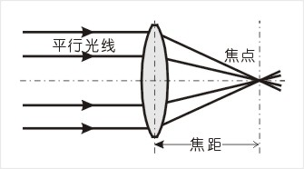

# 景深原理及计算
Ref. http://www.xh116.com/life/html/2013-04/201304102240092443.html

## 焦点 (focus)
　　平行光线射入凸透镜时，理想镜头将所有的光线聚集在一点，这个点，就叫做焦点，焦点和镜片光学中心的距离叫做焦距。过焦点后光线继续以锥状发散开来。

## 弥散圆 (Circle of Cnfusion)
　　又译为：弥散圈、模糊圈等等

　　在焦点前后，光线从聚集到扩散，点的影象从圆到点（焦点），继而有扩散到圆，这个焦点前面和后面的圆就叫做弥散圆。

　　如果此圆形足够小，肉眼依然可被视为点的成像。这个可以被接受的最大直径被称为容许弥散圆直径δ (Permissible circle of confusion)。

　　观赏拍摄的影象是以某种方式来观察的，人的肉眼所感受到的影象与观看距离有很大的关系，如果弥散圆的直径小于人眼的鉴别能力，人眼将感觉是清晰的。这时的弥散圆的大小就称为容许弥散圆。

　　人眼在明视距离（眼睛正前方）能够分辨的最小的物体的尺寸大约为。蔡斯公司制定的标准时，选用了常用尺寸7吋照片（175×）为依据计算，要求弥散圆只能在以内，按此计算得到是图像对角线长度的1/1730左右。所以蔡斯公司制定的标准就是弥散圆直径 δ=1/1730 底片对角线长度。

　　不同的厂家、不同的底片面积都有不同的容许弥散圆直径的要求。各厂家对于照相镜头的容许弥散圆的取值并不统一（前提是画面放大为5×7吋的大小，观察距离为25）一般取值范围是底片对角线长度的1/1000~1/1500左右。在这里可以看出：景深是相对的，不是绝对的，和弥散圆直径 δ的取值大小有着直接的关系。同时我们也可看出：弥散圆直径 δ 的取值的大小和镜头生产厂商的技术能力有关。

## 景深 (Depth of field)　　
在对焦时，通过镜头将在焦平面上清晰成像，而对焦点的前景和后景也在焦平面成像，只要它们成像的弥散圆等于或小于容许弥散圆直径，我们将认为是清晰的，这样影像就有一个的清晰的区间，这就是景深（下图）。 

　　从以上可知道，在焦点前后各有一个容许弥散圆，这两个弥散圆之间的距离我们称呼它叫焦深，它和景深是相对应的。所谓景深即：在被摄主体(对焦点)前后，其影像具有的一段清晰范围，这范围内的景物在焦平面上成像，都在容许弥散圆的限定范围内。

　　景深是随镜头的焦距、光圈值、对焦距离的不同而变化。一般来说：

 焦距短，景深大，

 对焦点离远，景深大，

 光圈小，景深大。

　　以拍摄者为基准，从对焦点到近点的清晰范围叫前景深，从对焦点到远点的清晰范围叫后景深。

## 景深的计算

　　从公式中可以看出，后景深 &gt; 前景深。

　　由景深计算公式可以看出，景深与镜头使用光圈、镜头焦距、拍摄距离以及对像质的要求（表现为对容许弥散圆的大小）有关。这些因素对景深的影响如下：

　　(1)、镜头光圈：光圈越大，景深越小；光圈越小，景深越大；

　　(2)、镜头焦距：镜头焦距越长，景深越小；焦距越短，景深越大；

　　(3)、拍摄距离：距离越远，景深越大；距离越近，景深越小。

## 计算实例

　　从上表大致看出景深和焦距、光圈之间的相互的影响：

　　①50mm/f 2.8镜头，清晰范围是从2.68m~3.40m，景深为0.72M。

　　②50mm/f 8镜头，清晰范围是从2.25m~4.52m，景深为2.272M。

　　③105mm/f 2.8镜头，清晰范围为2.92m~3.08m，景深为0.16M。

## 景深表
　　使用景深计算公式，我们可以完整地计算一张景深表，供我们日常摄影时便查（因为计算较为繁复，你是不可能在现场临时计算的），但是有的书籍中有是也提供现成景深表，下面就是书中提供的景深表，（这是尼康公司为尼柯镜头提供的）供大家参考。

　　　　景深表可以制成表格，也可以用其它方法制作。我按相机的镜头上常见的方法，根据计算，制作了一个转盘式的景深标尺，用这个标尺，要比查表方便一些。各位可以下载(见：《景深计算盘》一文)，用厚一点的纸张打印出来，中心用一个小钉订上，就可以使用了。

## 超焦距 （Hyperfocal Distance）
定义：在摄影镜头的焦距和光圈均已确定的前提下，能够获得最大景深时的摄影物距，称为在这个焦距和这个光圈下的超焦距。

　　以上是超焦距的定义，看起来有些费解，另外，超焦距又有什么用呢？为了说清楚，我就使用上面的景深标尺来讲述一下：

图一：##这个景深标尺，我相信的一看就懂：目前对焦是在2M上，你看不同的光圈值两边各有一根指示线，这两根线指示了该种光圈在距离2M时的，前景和后景的清晰范围。比如：如果用了F=11的光圈，清晰范围大约在1.5-3M。

图二：##这是镜头对焦在无穷远的情况，如果照风景，用光圈F=16，你可以看到大约在4.5M以外都清楚。

图三：##图二的这种对焦情况不是最好，因为这时的后景深就没利用上。

　　如果我们对焦在4.5M上，这时我们可以发现仍然用光圈为F=16时，那就用上了F=16的后景深：

　　后景深指示线对在无穷远上，这样对焦既保证了无穷远处的清晰度，而前景深指在2.2M处，清晰范围比图二前进了2M多，得到了最大的景深。

　　这就是##“超焦距”对焦法##，而##4.5M##这个对焦位置称呼##超焦距##。

　　超焦距的方法在抓拍时常用，因为在我已知的范围内（比如上面说的2.2M以外），就不用对焦了，抓了就照，可以抢时间，抓镜头，同时也保证了清晰度。所以新闻记者等是比较爱用的。

　　超焦距距离的计算比较繁，所以如果你的镜头上附有景深标尺的话，在对焦时将你选用的光圈值的后景深线对准无穷远，就可以了，不必计算，使用也方便。这也是镜头上带有景深标尺的一个很大的用途。

　　当然在没有这个标尺时，我们最好借助与景深表或转盘式的景深标尺这个工具了。
